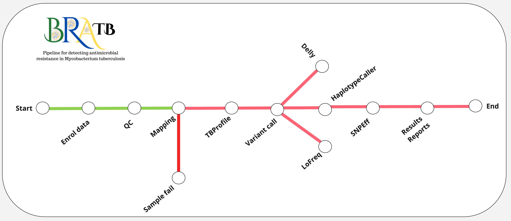

<!-- [](https://github.com/braseqtb/braseqtb/releases) -->
<!-- [](https://anaconda.org/bioconda/braseqtb) -->
[](https://gitpod.io/#https://github.com/braseqtb/braseqtb)


# bratb
BraTB is a flexible pipeline for the detection of antimicrobial resistance in Mycobacterium tuberculosis.

bratb can be split into two main parts:
[bratb Analysis Pipeline](https://braseqtb.github.io/latest/beginners-guide/), and
[bratb Tools](https://braseqtb.github.io/latest/braseqtb-tools/).


BraTB Analysis Pipeline is the main *per-isolate* workflow in BraTB. Built with
[Nextflow](https://www.nextflow.io/), input FASTQs (local or available from SRA/ENA)
are put through numerous analyses including: quality control, assembly, annotation,
minmer sketch queries, sequence typing, and more.



BraTB Tools are a set a independent workflows for comparative analyses. The comparative analyses
may include summary reports, pan-genome, or phylogenetic tree construction. Using the
[predictable output structure](https://braseqtb.github.io/latest/full-guide/) of bratb you can
pick and choose which samples to include for processing with a bratb Tool.

BraTB was inspired by [Staphopia](https://staphopia.github.io/) and MAGMA [MAGMA](https://github.com/TORCH-Consortium/MAGMA?tab=readme-ov-file#Prerequisites) 

# Documentation
Documentation for bratb is available at https://braseqtb.github.io/.

# Quick Start
```

# Installation
BraTB has **a lot** of tools built into its workflow. All these tools
lead to numerous dependencies, and navigating dependencies can often turn into a very
frustrating process. With this in mind, from the onset BraTB was developed to only
include programs that could be installable using [Conda](https://conda.io/en/latest/).

Conda is an open source package management system and environment management system that runs
on Windows, macOS and Linux. In other words, it makes it super easy to get the tools you need
installed! The [official Conda documentation](https://conda.io/projects/conda/en/latest/user-guide/install/index.html)
is a good starting point for getting started with Conda. BraTB has been tested using the
[Miniforge installer](https://github.com/conda-forge/miniforgel), but the
[Anaconda installer](https://www.anaconda.com/distribution/) should work the same.

Once you have Conda all set up, you are ready to create an environment for BraTB.

```
# Recommended
mamba create -n bratb -c conda-forge -c bioconda brastb

# or with standard conda
conda create -n bratb -c conda-forge -c bioconda bratb
```

After a few minutes you will have a new conda environment suitably named *bratb*. To
activate this environment, you will can use the following command:

```
conda activate bratb
```

And voilà, you are all set to get started processing your data!

# Please Cite Datasets and Tools
If you have used BraTB in your work, please be sure to cite any datasets or tools you may
have used. [A list of each dataset/tool used by BraTB has been made available](https://braseqtb.github.io/latest/impact-and-outreach/acknowledgements/). 

*If a citation needs to be updated please let me know!*

# Acknowledgements
BraTB is truly a case of *"standing upon the shoulders of giants"*. Nearly every component
of BraTB was created by others and made freely available to the public.

# Feedback
Your feedback is very valuable! If you run into any issues using BraTB, have questions, or have some ideas to improve BraTB, I highly encourage you to submit it to the [Issue Tracker](https://github.com/braseqtb/braseqtb/issues).

# License
[MIT License](https://raw.githubusercontent.com/braseqtb/braseqtb/master/LICENSE)

# Citation

# Author

* Louise Cerdeira
* Twitter: [@louisecerdeira](https://twitter.com/louisecerdeira)

<!-- * Naila
* Twitter: [@](https://twitter.com/)

* Ana Márcia Guimarães
* Twitter: [@anaguimaraes](https://twitter.com/) -->

## Funding

Support for this project came from an CNPq...